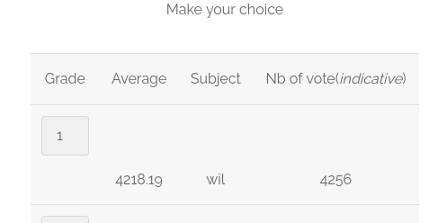
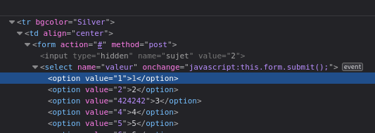

# Form Field Manipulation

When analysing the "Survey" page, you can notice that one subject has a very high average, more than should be possible.
Indeed. the maximum grade is "10" and he has an average of "4218.19".

## The Vuln

This is indicative of a vulnerability where the form value is not properly validated server side, resulting in outrageous values being possible if we edit the html content before submitting.

