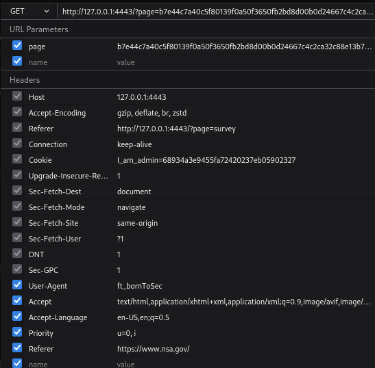

# Referrer Header Spoofing

While analysing the copyright page, I stumbled upon an interesting comment left by the developper (see below). It seemed to suggest that using a sepcific browser and coming form a specific location, you might be able to access a hidden feature.
```<!--
/.../
-->             
<!--
You must come from : "https://www.nsa.gov/".
-->                                    
/.../
<!--
Let's use this browser : "ft_bornToSec". It will help you a lot.
-->
```
## The "Vuln"

I resent the request for this webpage, but modifying the User-Agent and overwriting the Referrer as follows:



## Flag

Here is the flag resulting from this vulnerability:
```
f2a29020ef3132e01dd61df97fd33ec8d7fcd1388cc9601e7db691d17d4d6188
```